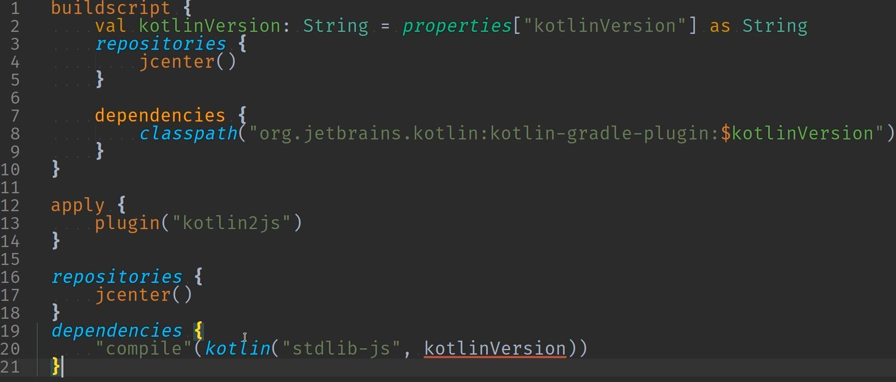

= Dessine moi un DSL en Kotlin
:icons: font
:asset-uri-scheme: https
:source-highlighter: highlightjs
:deckjs_theme: swiss
:deckjs_transition: fade
:navigation: false
:goto: true
:status: true
:conf: bdxio

image::images/{conf}.jpg[float="right"]

== Benoit Prioux

icon:twitter[] @binout +
icon:github[] https://github.com/binout

image::images/lectra.png[]

image::images/lectra-versalis.jpg[versalis, 800]

== Domain Specific Language

TODO

== Exemple : Jenkinsfile (Groovy)

image::images/jenkinsfile.png[]

== Exemple : Gatling (Scala)

image::images/gatling.png[]

== Et en Kotlin ?

image::images/android.png[float="left"]

== Operators overloading

[source, kotlin]
----
collection += element
collection.add(element)
----

[source, kotlin]
----
a + b
a.plus(b)
----

== Type aliases

[source, kotlin]
----
typealias Point = Pair
----

== get/set methods convention

[source, kotlin]
----
map["key"] = "value"
map.put("key", "value")
----

== Destructuring declaration

[source, kotlin]
----
val (x, y) = Point(0, 0)
val p = Point(0, 0); val x = p.first; val y = p.second
----

== Lambda out of parentheses

[source, kotlin]
----
list.forEach { ... }
list.forEach({...})
----

== Extension functions

[source, kotlin]
----
mylist.first(); // there isn’t first() method in mylist collection
----

== Infix functions

[source, kotlin]
----
1 to "one"
1.to("one")
----

== Lambda with receiver

[source, kotlin]
----
Person().apply { name = «John» }
----

== Démo

Jenkinsfile en Kotlin

== Conclusion

[quote]
Ecrire un DSL en Kotlin c'est facile et en plus ce n'est pas magique !