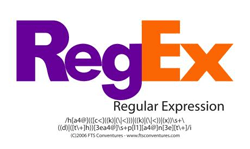
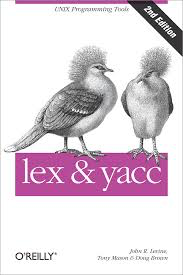
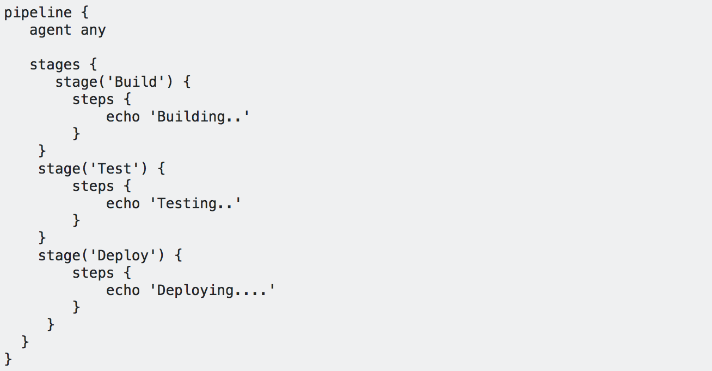
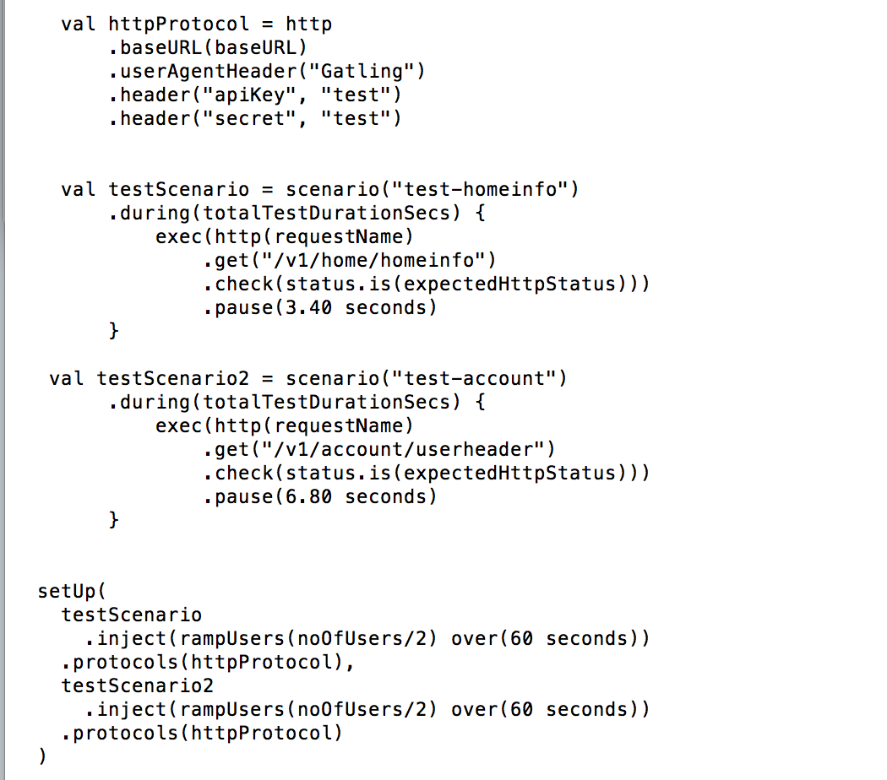
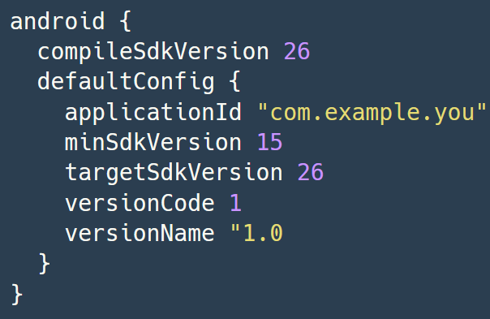
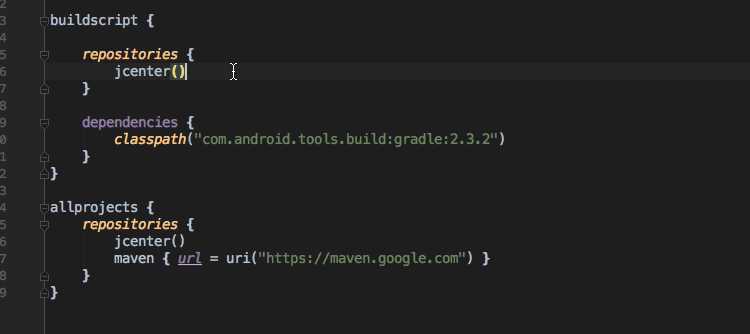
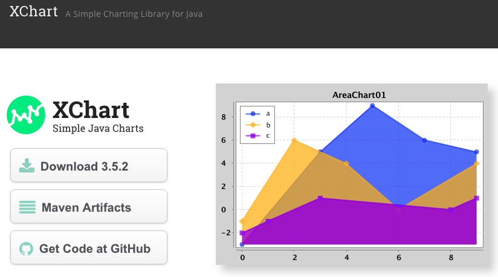

= Dessine moi un DSL en Kotlin 
:icons: font
:asset-uri-scheme: https
:source-highlighter: highlightjs
:deckjs_theme: swiss
:deckjs_transition: fade
:navigation: false
:goto: true
:status: true
:conf: bdxio
:src: ./src/main/kotlin/io/github/binout/kotlin

image::images/{conf}.jpg[float="right"]

== Benoit Prioux

icon:twitter[] @binout +
icon:github[] https://github.com/binout

image::images/lectra.png[]

== Domain Specific Language

[quote]
Facile à lire, écrire, comprendre

* Langage avec une syntaxe spécifique à un domain métier
* Permet de masquer la complexité d'une API technique sous-jacente

== Specific DSL

* Langage dédié avec une syntaxe spécifique
* Nécessite d'implémenter un parseur

== Embedded DSL

* Utiliser un langage existant comme support
* Réussir à abstraire le langage support

== Exemple : Jenkinsfile (Groovy)

.Jenkinsfile

== Exemple : Gatling (Scala)

.Scenario Gatling

== Et en Kotlin !

.Android

== Et en Kotlin !

.Gradle

== Pourquoi Kotlin ?

[quote]
____
* Statiquement typé
* Support de l'IDE (complétion)
* Langage désigné pour faciliter l'écriture de DSL
____

== Démo

////
== Operators overloading

[source, kotlin]
----
include::{src}/Examples.kt[tag=operator]
----

== Destructuring declaration

[source, kotlin]
----
include::{src}/Examples.kt[tag=destructuring]
----

== get/set methods convention

[source, kotlin]
----
include::{src}/Examples.kt[tag=getset]
----
////

== Lambda out of parentheses

[source, kotlin]
----
include::{src}/Examples.kt[tag=parentheses]
----

== Extension functions

[source, kotlin]
----
include::{src}/Examples.kt[tag=point]

include::{src}/Examples.kt[tag=extension]
----

== Infix functions

[source, kotlin]
----
include::{src}/Examples.kt[tag=point]

include::{src}/Examples.kt[tag=infix]
----

== Lambda with receiver

[source, kotlin]
----
include::{src}/Examples.kt[tag=point]

include::{src}/Examples.kt[tag=receiver]
----

== Conclusion

[quote]
Ecrire un DSL en Kotlin c'est facile et pas besoin de magie !

https://github.com/binout/kotlin-dsl

image::images/lovekotlin.png[float=right]
