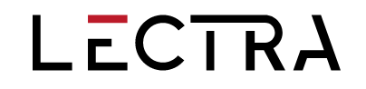

= Dessine moi un DSL en Kotlin
:icons: font
:asset-uri-scheme: https
:source-highlighter: highlightjs
:deckjs_theme: swiss
:deckjs_transition: fade
:navigation: false
:goto: true
:status: true
:conf: bdxio

image::images/{conf}.jpg[float="right"]

== Me

icon:twitter[] @binout +
icon:github[] https://github.com/binout

image::images/lectra-versalis.jpg[versalis, 800]

== Domain Specific Language